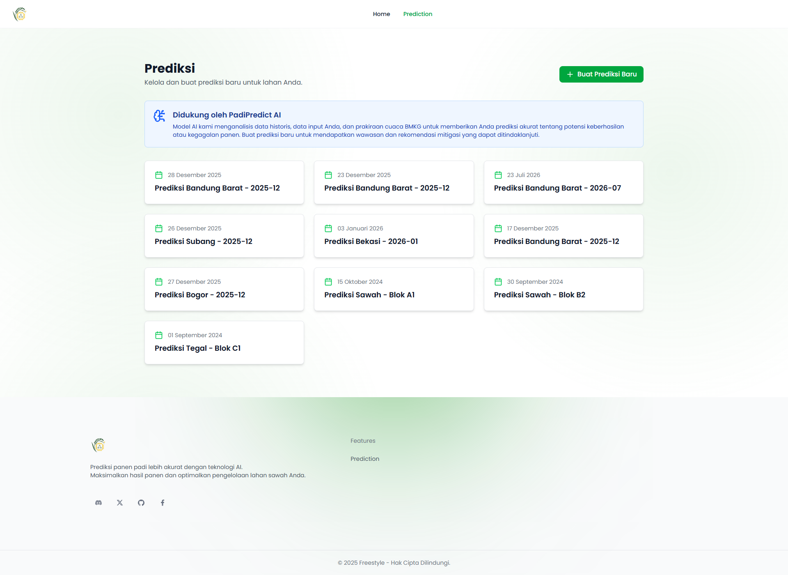
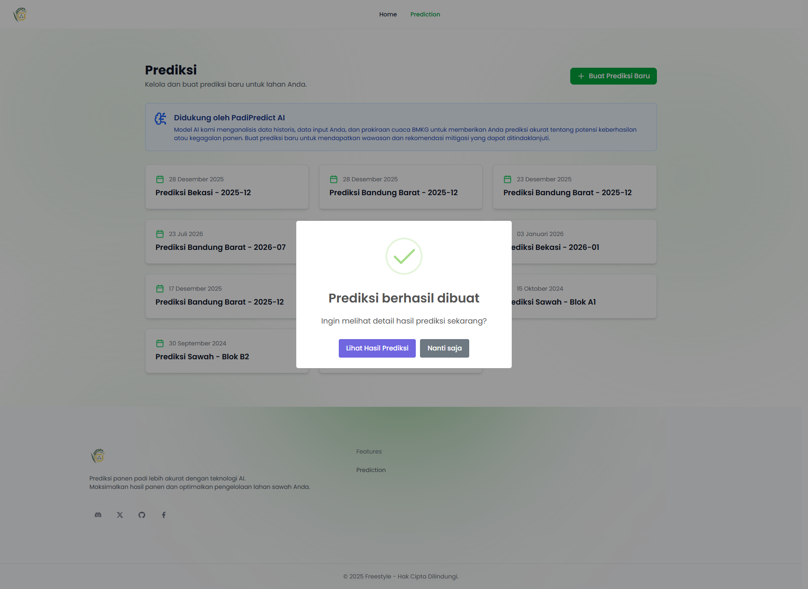
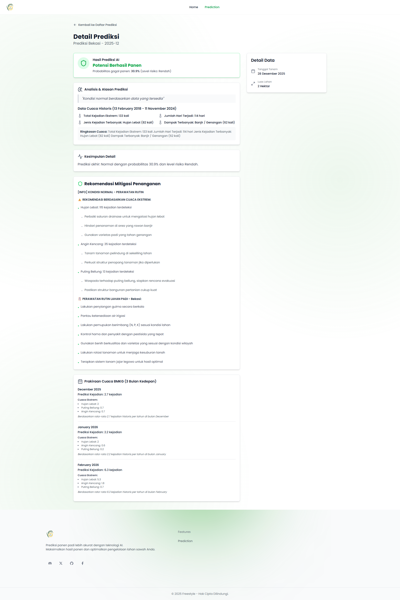

# 🌾 Sistem Prediksi Gagal Panen Padi dengan AI


> **Solusi Cerdas Ketahanan Pangan:** Mendeteksi dini risiko gagal panen padi menggunakan analisis data historis, kondisi cuaca, dan faktor lingkungan dengan algoritma *Gated Recurrent Unit* (GRU).

---

## 📸 Antarmuka Aplikasi (User Journey)

Berikut adalah alur penggunaan aplikasi mulai dari halaman utama hingga hasil detail prediksi.

| **1. Halaman Utama (Landing Page)** | **2. Dashboard Daftar Prediksi** |
|:---:|:---:|
|  |  |
| *Halaman depan yang menampilkan fitur unggulan.* | *Riwayat prediksi yang telah dilakukan.* |

| **3. Form Input Data Baru** | **4. Notifikasi Berhasil** |
|:---:|:---:|
|  |  |
| *Input lokasi, tanggal tanam, dan luas lahan.* | *Konfirmasi bahwa AI selesai memproses data.* |

### 5. Detail Hasil Analisis & Mitigasi

> *Menampilkan probabilitas keberhasilan, analisis cuaca historis, dan rekomendasi langkah mitigasi konkret.*

---

## 📋 Prasyarat Sistem

Sebelum memulai, pastikan perangkat Anda memiliki spesifikasi berikut:

### Software
* **Python 3.10+**: Untuk backend Machine Learning & API.
* **Node.js 16+**: Environment JavaScript.
* **Bun**: Package manager super cepat untuk frontend.
* **Git**: Untuk manajemen versi.

### Hardware
* **RAM**: Minimal 4GB (Rekomendasi 8GB+).
* **Storage**: Minimal 2GB ruang kosong.
* **CPU**: Dukungan standar (GPU opsional).

## 🚀 Instalasi Lengkap

### 1. Clone Repository
```bash
git clone <repository-url>
cd itfair
```

### 2. Install Python Dependencies (ML & Backend)
```cmd
# Install semua dependencies Python dalam satu perintah
pip install tensorflow==2.10.0 numpy pandas scikit-learn joblib fastapi uvicorn python-multipart "supabase<2.0.0" "pydantic>=1.6.2,<2.0.0" "httpx<0.24.0" "postgrest<0.11.0" "websockets<12.0"

# Verifikasi instalasi
python -c "import tensorflow, fastapi, supabase, pandas, numpy, sklearn; print('✅ All Python dependencies installed successfully!')"
```

### 3. Install Frontend Dependencies
```cmd
cd frontend
bun install

# Verifikasi instalasi
bun --version
```

### 4. Install Bun (jika belum ada)
```cmd
# Via npm
npm install -g bun

# Atau langsung (PowerShell)
powershell -c "irm bun.sh/install.ps1 | iex"
```

---

## 🏃‍♂️ Menjalankan Project

### Buka 3 Terminal/CMD Terpisah:

#### Terminal 1: Training Model (Hanya sekali)
```cmd
cd c:\laragon\www\itfair
python ml\src\train.py
```
**Output yang diharapkan:**
```
[1/4] Memuat data...
[2/4] Membangun model...
[3/4] Melatih model...
[4/4] Menyimpan model dan scaler...
✅ Training selesai! Model disimpan di ml\models\gru_model.keras
```

#### Terminal 2: Jalankan API Backend
```cmd
cd c:\laragon\www\itfair\ml
uvicorn api.main:app --reload --port 8001
```
**Output yang diharapkan:**
```
INFO:     Uvicorn running on http://127.0.0.1:8001
INFO:     Application startup complete.
```

#### Terminal 3: Jalankan Frontend
```cmd
cd c:\laragon\www\itfair\frontend
bun run dev
```
**Output yang diharapkan:**
```
🚀 Server running at http://localhost:3000/
Bundled page in 560ms: src/index.html
```

---

## 🌐 Akses Aplikasi

- **Frontend**: http://localhost:3000
- **API Documentation**: http://localhost:8001/docs
- **API Direct**: http://localhost:8001

---

## 📖 Cara Penggunaan

### 1. Melakukan Prediksi
1. Buka http://localhost:3000 di browser
2. Klik tombol "Mulai Prediksi" atau navigasi ke `/prediction`
3. Pilih wilayah dari dropdown (contoh: Garut, Bandung, dll)
4. Pilih bulan penanaman (opsional, default: bulan saat ini)
5. Klik tombol "Prediksi"
6. Lihat hasil prediksi dengan:
   - Probabilitas gagal panen
   - Level risiko (Rendah/Sedang/Tinggi)
   - Data cuaca historis
   - Rekomendasi mitigasi

### 2. API Endpoints
```bash
# Mendapatkan daftar wilayah
GET http://localhost:8001/regions

# Melakukan prediksi
POST http://localhost:8001/predict
Content-Type: application/json
{
  "region": "Garut",
  "planting_month": 11
}
```

---

## 📁 Struktur Project

```
itfair/
├── ml/                          # Backend ML & API
│   ├── src/
│   │   ├── train.py            # Training model
│   │   ├── predict.py          # Prediksi
│   │   ├── data_processing.py  # Preprocessing data
│   │   ├── recommendations.py  # Rekomendasi
│   │   └── config.py           # Konfigurasi
│   ├── api/
│   │   └── main.py             # FastAPI server
│   ├── data/                   # Data files
│   │   ├── sample_data_cuaca.csv
│   │   └── data_kesimpulan_processed.csv
│   └── models/                  # Model hasil training
├── frontend/                    # React Frontend
│   ├── src/
│   │   ├── pages/User/Prediction.tsx
│   │   └── components/
│   └── package.json
└── README.md
```

---

## 🔧 Troubleshooting

### Masalah Umum:

#### 1. "ImportError: cannot import name 'keras' from 'tensorflow'"
**Solusi:**
```cmd
pip uninstall -y tensorflow tensorflow-intel
pip install tensorflow==2.10.0
```

#### 2. "ModuleNotFoundError: No module named 'tensorflow.compat'"
**Solusi:**
```cmd
pip install "supabase<2.0.0" "pydantic>=1.6.2,<2.0.0" "httpx<0.24.0" "postgrest<0.11.0" "websockets<12.0"
```

#### 3. "Data cuaca tidak tersedia"
**Solusi:**
- Pastikan file `ml/data/sample_data_cuaca.csv` ada
- Cek log API untuk filter wilayah

#### 4. CUDA/GPU Errors
**Solusi:**
- Ini normal, project dirancang untuk CPU
- Ignore warning tentang CUDA DLL

### Verifikasi Instalasi:
```cmd
# Test TensorFlow
python -c "import tensorflow as tf; print(f'TensorFlow: {tf.__version__}')"

# Test API
curl http://localhost:8001/regions

# Test Frontend
curl http://localhost:3000
```

---

## 📊 Model & Data

### Model:
- **Arsitektur**: GRU (Gated Recurrent Unit)
- **Input**: Sequence data cuaca historis
- **Output**: Probabilitas gagal panen (0-1)
- **Threshold**: 0.5 (default)

### Data:
- **Data Cuaca**: 10 tahun historis (2015-2025)
- **Wilayah**: 27 kabupaten/kota di Jawa Barat
- **Fitur**: Cuaca ekstrem, dampak, produktivitas historis

---

## 🔄 Maintenance

### Update Model:
```cmd
# Jalankan ulang training dengan data baru
python ml\src\train.py
```

### Backup Model:
```cmd
# Backup folder models
copy ml\models ml\models_backup_%date%
```

### Monitoring:
- Cek log API untuk error
- Monitor akurasi prediksi
- Update data cuaca berkala

---

## 🤝 Kontribusi

1. Fork repository
2. Buat branch baru (`git checkout -b feature/AmazingFeature`)
3. Commit changes (`git commit -m 'Add some AmazingFeature'`)
4. Push ke branch (`git push origin feature/AmazingFeature`)
5. Buka Pull Request

---

## 📄 License

Project ini dilisensikan under MIT License - lihat file [LICENSE](LICENSE) untuk detail.

---

## 📞 Support

Jika mengalami masalah:
1. Cek section Troubleshooting di atas
2. Lihat log di terminal untuk error details
3. Pastikan semua dependencies terinstall dengan benar
4. Restart services jika perlu

**Happy Coding! 🚀**